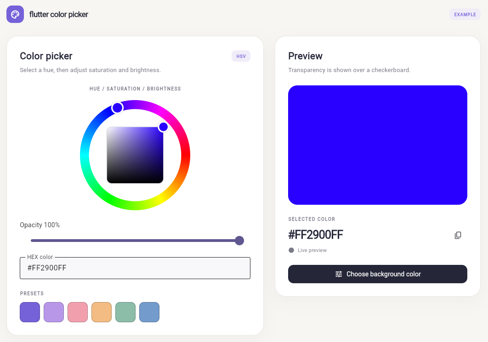
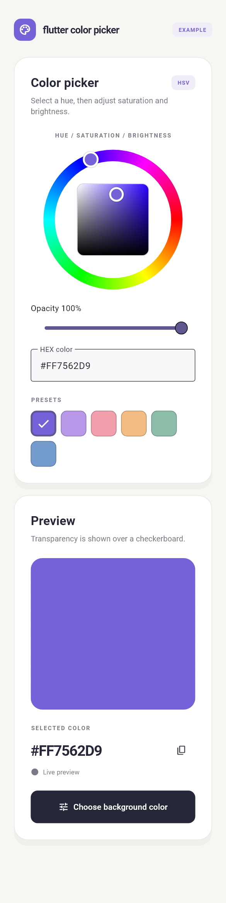

# Flutter Color Picker — HSV Color Wheel, HEX Input & Opacity Slider

`flutter_color_picker` is a Flutter color picker package with an HSV color wheel,
saturation and brightness selection, an alpha/opacity slider, RGB and ARGB HEX
input, and preset color swatches. Embed individual widgets and get selected
colors through a callback, a controller, or a Dart broadcast stream.

**Built with the Dart and Flutter SDKs only.** No third-party dependencies,
platform plugins, HTTP requests, or external state-management libraries.

| Desktop example | Mobile example |
| --- | --- |
|  |  |

## Contents

- [Features](#features)
- [Installation](#installation)
- [Quick start: get a color with a callback](#quick-start-get-a-color-with-a-callback)
- [Complete example: synchronized color controls](#complete-example-synchronized-color-controls)
- [Get color updates as a stream](#get-color-updates-as-a-stream)
- [Return a color from your own dialog](#return-a-color-from-your-own-dialog)
- [Widget and controller API](#widget-and-controller-api)
- [HEX color formats](#hex-color-formats)
- [Theming and localization](#theming-and-localization)
- [Keyboard and screen-reader support](#keyboard-and-screen-reader-support)
- [Implementation details](#implementation-details)
- [Run the example and tests](#run-the-example-and-tests)
- [FAQ](#faq)

## Features

| Feature | Behavior |
| --- | --- |
| HSV color wheel | Tap or drag the hue ring to choose a hue. |
| Saturation/value square | Horizontal movement changes saturation; vertical movement changes brightness. |
| Opacity slider | Adjust alpha independently without changing HSV. |
| HEX color input | Enter six-digit RGB or eight-digit ARGB, with or without `#`. |
| Color swatch palette | Supply brand colors, presets, or an app-managed recent-color list. |
| Shared controller | Synchronize every attached widget and update selection programmatically. |
| Callback and stream | Receive Flutter `Color` values through `onChanged` or `controller.colors`. |
| Accessibility | Keyboard selection, visible wheel focus, and adjustable HSV semantics. |
| Composable UI | Use the picker inline, in a panel, a bottom sheet, or an app-owned dialog. |

Useful for theme editors, background color selection, drawing tools, design
settings, brand palettes, and invitation or QR appearance editors. Domain-specific
previews, color contrast checks, QR rendering, and persistence belong to your app.

## Installation

### Requirements

- Dart SDK `>=3.4.0 <4.0.0`.
- Flutter SDK `>=3.27.0`.
- A Flutter app with a Material theme for the supplied Material controls.

### Local package

Point your application's `pubspec.yaml` at the package directory:

```yaml
dependencies:
  flutter:
    sdk: flutter
  flutter_color_picker:
    path: ../flutter_color_picker

flutter:
  uses-material-design: true
```

Adjust the relative path to match your project layout. `uses-material-design`
includes Flutter's built-in icon font for the selected-swatch checkmark and
example icons; it does not add a third-party dependency.

```sh
flutter pub get
```

```dart
import 'package:flutter_color_picker/flutter_color_picker.dart';
```

This README documents the local package. It does not assume that the package
has been published to pub.dev.

## Quick start: get a color with a callback

```dart
ColorWheelPicker(
  initialColor: const Color(0xFF7562D9),
  size: 240,
  onChanged: (Color color) {
    // Store or apply the selected color in your app.
    debugPrint('Selected ARGB: ${color.toARGB32().toRadixString(16)}');
  },
)
```

Without a controller, the wheel owns and disposes its selection state.
`initialColor` is used once when the widget is created. Rebuilding with a new
`initialColor` does not reset the selection: use a controller for controlled updates.
The wheel preserves the initial color's alpha; add the opacity widget to edit it.

## Complete example: synchronized color controls

```dart
import 'package:flutter/material.dart';
import 'package:flutter_color_picker/flutter_color_picker.dart';

class ColorSettings extends StatefulWidget {
  const ColorSettings({super.key});

  @override
  State<ColorSettings> createState() => _ColorSettingsState();
}

class _ColorSettingsState extends State<ColorSettings> {
  final _controller = ColorPickerController(
    initialColor: const Color(0xFF7562D9),
  );

  @override
  void dispose() {
    _controller.dispose();
    super.dispose();
  }

  @override
  Widget build(BuildContext context) {
    return SingleChildScrollView(
      padding: const EdgeInsets.all(24),
      child: Column(
        mainAxisSize: MainAxisSize.min,
        children: [
          ColorWheelPicker(controller: _controller),
          const SizedBox(height: 16),
          ColorOpacitySlider(controller: _controller),
          ColorHexField(controller: _controller),
          const SizedBox(height: 16),
          ColorSwatchPalette(
            controller: _controller,
            colors: const [
              Color(0xFF7562D9),
              Color(0xFFF19FAD),
              Color(0xFF8BBDA9),
              Colors.black,
              Colors.white,
            ],
          ),
          const SizedBox(height: 16),
          StreamBuilder<Color>(
            stream: _controller.colors,
            initialData: _controller.color,
            builder: (context, snapshot) => Container(
              width: 160,
              height: 80,
              color: snapshot.data ?? _controller.color,
            ),
          ),
        ],
      ),
    );
  }
}
```

Place `ColorSettings` inside a `MaterialApp` and `Scaffold`. All four controls
share one selection. Editing HEX, opacity, or a preset immediately updates the
other controls and the stream-driven preview.

## Get color updates as a stream

```dart
final controller = ColorPickerController(initialColor: Colors.red);

final subscription = controller.colors.listen((Color color) {
  // React to user selections and programmatic changes.
});

// Attach the controller to any of the picker widgets.
ColorWheelPicker(controller: controller);

// Programmatic RGB/ARGB update.
controller.color = const Color(0xFF2900FF);

// Programmatic HSV update that preserves alpha.
controller.setHsvColor(controller.hsvColor.withHue(120));

// When finished with the subscription:
await subscription.cancel();
// Dispose the controller when its owning screen/state is disposed.
controller.dispose();
```

| API | Emission behavior |
| --- | --- |
| Widget `onChanged` | User changes from that widget, when the rendered ARGB value changes. |
| `controller.colors` | Distinct ARGB changes from any attached control or programmatic update. |
| `controller.addListener` | HSV state changes, even if the visible ARGB value stays the same. |

The color stream is **synchronous, broadcast, and non-replaying**. Multiple
listeners can subscribe. Read `controller.color` for the current selection or
supply it as a `StreamBuilder`'s `initialData`.

A hue change at black or zero saturation may not change the visible color.
The controller still retains the new hue and notifies its `ChangeNotifier`
listeners, so it can be restored when brightness or saturation increases.

Do not synchronously change the same controller from inside its color-stream
listener: the synchronous stream cannot emit recursively. Schedule any derived
selection update after the current event instead.

## Return a color from your own dialog

The package provides widgets, not a dialog function. Your app decides where the
picker appears and when a provisional color becomes a confirmed selection.

```dart
Future<Color?> pickColor(BuildContext context, Color initialColor) async {
  final draft = ColorPickerController(initialColor: initialColor);
  try {
    return await showDialog<Color>(
      context: context,
      builder: (dialogContext) => AlertDialog(
        title: const Text('Choose color'),
        content: SingleChildScrollView(
          child: ColorWheelPicker(controller: draft),
        ),
        actions: [
          TextButton(
            onPressed: () => Navigator.of(dialogContext).pop(),
            child: const Text('Cancel'),
          ),
          FilledButton(
            onPressed: () => Navigator.of(dialogContext).pop(draft.color),
            child: const Text('Apply'),
          ),
        ],
      ),
    );
  } finally {
    draft.dispose();
  }
}
```

Apply resolves the `Future<Color?>` with the selected color. Cancel, back, or
barrier dismissal resolves it with `null`. Because the dialog uses its own draft
controller, cancelling leaves your application's confirmed selection unchanged.

For the complete dialog with opacity, HEX input, swatches, and a responsive
preview, see [the example dialog](example/lib/color_picker_dialog.dart).

## Widget and controller API

### `ColorWheelPicker`

| Parameter | Default | Purpose |
| --- | --- | --- |
| `controller` | `null` | Optional external selection controller. |
| `initialColor` | `Color(0xFFFF0000)` | Starting color when no controller is supplied. |
| `onChanged` | `null` | Receives user-selected `Color` values. |
| `size` | `220` | Square size in logical pixels; must be finite and at least `120`. |
| `semanticLabel` | `Color picker` | Accessible group label. |
| `hueLabel` | `Hue` | Accessible hue channel label. |
| `saturationLabel` | `Saturation` | Accessible saturation channel label. |
| `brightnessLabel` | `Brightness` | Accessible brightness channel label. |

Allow enough horizontal space for `size`. Use a `FittedBox` around the wheel
when embedding it into a narrower container.

### `ColorOpacitySlider`

| Parameter | Default | Purpose |
| --- | --- | --- |
| `controller` | Required | Shared selection controller. |
| `onChanged` | `null` | Receives user opacity changes as `Color` values. |
| `label` | `Opacity` | Visible and accessible slider label. |

The displayed percentage is rounded. The controller stores alpha as a value
between `0` and `1`; the stream compares rendered 8-bit ARGB values.

### `ColorHexField`

| Parameter | Default | Purpose |
| --- | --- | --- |
| `controller` | Required | Shared selection controller. |
| `onChanged` | `null` | Receives valid user color changes. |
| `label` | `HEX color` | Input label. |
| `invalidMessage` | `Enter 6 RGB or 8 ARGB hexadecimal digits` | Validation feedback. |

### `ColorSwatchPalette`

| Parameter | Default | Purpose |
| --- | --- | --- |
| `controller` | Required | Shared selection controller. |
| `colors` | Required | Caller-supplied `List<Color>`. |
| `onChanged` | `null` | Receives user swatch changes. |
| `swatchSize` | `44` | Swatch size in logical pixels; minimum `44`. |
| `semanticLabel` | `Select color` | Accessible button label prefix. |

Swatches wrap onto multiple rows. Selected state uses ARGB equality, including
alpha. Each swatch has a HEX tooltip and a selected checkmark. The app owns
palette generation and recent-color persistence.

### `ColorPickerController`

| Member | Purpose |
| --- | --- |
| `ColorPickerController(initialColor: ...)` | Creates selection state; defaults to opaque red. |
| `color` | Read the current color or assign a new Flutter `Color`. |
| `hsvColor` | Read the current `HSVColor`, including alpha. |
| `setHsvColor(HSVColor)` | Update HSV while retaining hue at black or gray. |
| `colors` | Broadcast `Stream<Color>` of distinct rendered ARGB changes. |
| `addListener` / `removeListener` | Observe all HSV changes through `ChangeNotifier`. |
| `dispose()` | Close the stream and release notifier resources. |

Caller-supplied controllers belong to the caller. Keep them alive while widgets
use them and dispose them when their owning state is disposed. The wheel disposes
only a controller it created internally. Updates after disposal throw `StateError`.

## HEX color formats

| Input | Interpretation |
| --- | --- |
| `7562D9` or `#7562D9` | Opaque RGB; equivalent to `0xFF7562D9`. |
| `807562D9` or `#807562D9` | ARGB with alpha first; approximately 50% opacity. |
| `FF2900FF` | Opaque ARGB, as shown in the example screenshot. |

**Eight digits use `AARRGGBB`, not CSS `RRGGBBAA`.** Three/four-digit shorthand,
`0x` prefixes, color names, and `rgb(...)` strings are not accepted. Leading and
trailing whitespace is trimmed; uppercase and lowercase hexadecimal are accepted.

Complete valid input applies immediately. Invalid or incomplete input keeps the
last valid selection. Submitting or leaving the field displays validation feedback.
A later external selection replaces the field text and clears the error.

To format a Flutter color for display or storage:

```dart
final argb = controller.color.toARGB32();
final hex = '#${argb.toRadixString(16).padLeft(8, '0').toUpperCase()}';
final restored = Color(argb);
```

## Theming and localization

The controls use your app's Material `ThemeData`: slider styling, text-field
styling, focus color, and selected-swatch border follow the theme. The wheel's
spectrum and saturation/value gradients are painted directly and keep their
color-selection meaning across themes.

```dart
Theme(
  data: Theme.of(context).copyWith(
    colorScheme: ColorScheme.fromSeed(seedColor: const Color(0xFF7562D9)),
  ),
  child: ColorOpacitySlider(controller: controller, label: 'Opacity'),
)
```

Pass translated values for the wheel's semantic labels, opacity `label`, HEX
`label` and `invalidMessage`, and swatch `semanticLabel`. The package does not
include a translation dependency. The HEX format hint and semantic units such as
`degrees` are currently built-in English strings.

## Keyboard and screen-reader support

Tab to the wheel to focus it; a border indicates keyboard focus.

| Key | Adjustment |
| --- | --- |
| Left / Right | Decrease / increase saturation by `0.01`. |
| Down / Up | Decrease / increase brightness by `0.01`. |
| Shift + an arrow | Decrease / increase hue by one degree, wrapping around the spectrum. |

Separate adjustable semantics expose hue, saturation, and brightness to screen
readers. The opacity slider uses Flutter's slider semantics; the HEX field is an
editable text control. Swatches expose button labels and selected state, with
Material keyboard activation.

Keyboard and semantic behavior is covered by widget tests. Assistive-technology
behavior should also be checked on your target devices.

## Implementation details

### Rendering and selection math

The wheel uses `CustomPainter`, `Canvas`, and Flutter gradients, with `dart:math`
for polar-coordinate calculations. There are no image assets for the picker.

- **Hue ring:** a `SweepGradient` draws the spectrum. Pointer hue is calculated
  with `atan2(dy, dx)` and normalized to `[0, 360)` degrees.
- **Saturation/value square:** a horizontal white-to-hue gradient is overlaid
  with a vertical transparent-to-black gradient. Normalized x selects saturation;
  `1 - normalizedY` selects brightness.
- **Geometry:** painting and hit-testing use the same center, radii, and rounded
  square bounds. The square is fitted inside the ring with a gap.
- **Interaction:** taps select a color immediately. A drag remains assigned to
  the hue ring or square it started in; square values clamp to `[0, 1]`.
- **Thumbs:** painted selection markers show the current hue and saturation/value.

### State and synchronization

`ColorPickerController` stores `HSVColor` rather than only RGB. This preserves
hue when saturation or brightness is zero. Widgets listen through
`ChangeNotifier`/`AnimatedBuilder`; the HEX field maintains its own editing state
and synchronizes with external selections.

Each update compares the previous and next `Color.toARGB32()` values. The
synchronous `StreamController<Color>.broadcast` emits only a changed rendered
color, while notifier listeners receive changed HSV state.

### Package layout

```text
lib/
  flutter_color_picker.dart       Public exports
  src/
    controller.dart              HSV state, notifier and color stream
    picker.dart                  Public wheel, keyboard and semantics
    wheel.dart                   Internal gestures, geometry and painting
    controls.dart                Opacity, HEX input and swatches
example/
  lib/main.dart                  Inline picker and stream-driven preview
  lib/color_picker_dialog.dart   App-owned dialog returning Future<Color?>
  test/                          Dialog and responsive-layout tests
screenshots/
  color-picker.png               Supplied README screenshot
  desktop.png                    Generated desktop render
  mobile.png                     Mobile layout preview
```

Import the public library rather than files under `src/`. The package exports
four widgets and one controller. Dialogs, preview composition, clipboard actions,
storage, and business validation remain in the consuming application.

### Dependencies and platforms

Runtime dependencies contain only `flutter: sdk: flutter`; test dependencies
contain only `flutter_test: sdk: flutter`. Dart imports use SDK libraries.
Flutter itself resolves its own transitive packages, but this package adds no
third-party packages.

The implementation uses portable Flutter widgets with no native platform code.
It is intended for Android, iOS, web, Windows, macOS, and Linux. The example
currently includes Android and web runners; the web example has been launched
locally. Native behavior on every platform has not been verified.

## Run the example and tests

From the package directory:

```sh
flutter pub get
flutter analyze
flutter test
```

Run the example:

```sh
cd example
flutter pub get
flutter run -d chrome
```

Or choose an available Android device with `flutter devices` and `flutter run`.
Run the example tests separately with `flutter test` from `example`.

### Generate documentation screenshots

The example's screenshot test renders desktop and mobile layouts. It requires
real fonts for screenshot capture; normal layout tests do not need them.

From `example`, in PowerShell:

```powershell
$env:CAPTURE_SHOWCASE = '1'
$env:SHOWCASE_FONT_DIR = 'C:\path\to\flutter\bin\cache\artifacts\material_fonts'
flutter test test/showcase_test.dart
```

The output is written to `screenshots/desktop.png` and `screenshots/mobile.png`
in the package root. See [the example README](example/README.md).

## FAQ

### Can I get a selected color without using a dialog?

Yes. Use the wheel's `onChanged` callback or read `controller.color`. The package
never requires a dialog, bottom sheet, or full-screen route.

### Can I listen to colors as a Dart stream?

Yes. `controller.colors` is a broadcast stream. Use `initialData` when rendering
with `StreamBuilder` because the stream does not replay the current selection.

### Does it support RGB and HEX colors?

Yes. It accepts Flutter `Color` values and six-digit RGB/eight-digit ARGB HEX.
The wheel edits HSV internally. Separate numeric RGB/HSV input fields are not
part of the current API.

### Does it store recent colors or settings?

No. Supply your own palette list and persist `color.toARGB32()` in your app.
The package performs no file, database, or network operations.

### Does it include an eyedropper or contrast checker?

No. Screen sampling and contrast validation are outside the current API.

### What should I check before publishing?

Choose a license and add a `LICENSE` file, provide your repository/issue-tracker
URLs in `pubspec.yaml`, and verify the package name and release configuration.
No license or public repository URL is assumed by this README.
